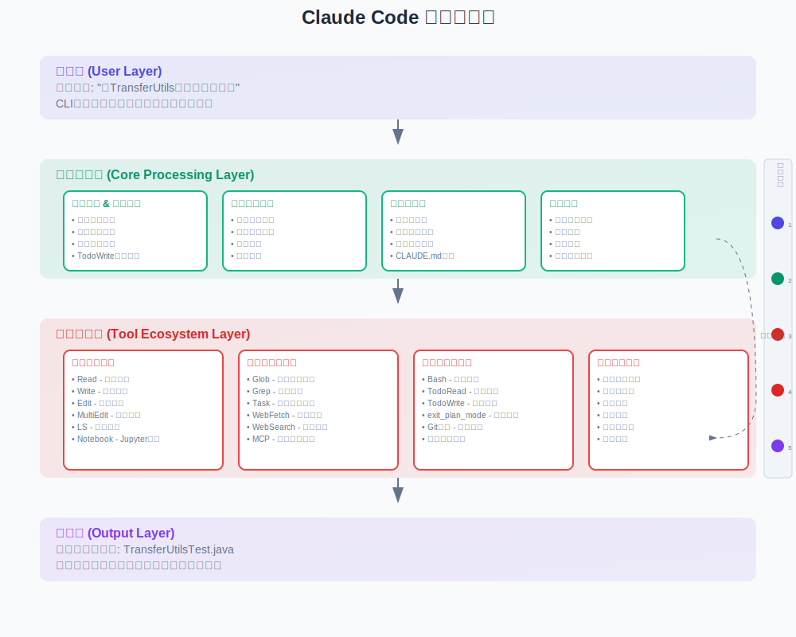

# Claude Code的Agent设计理念

## **核心设计：主Agent + 有限子Agent + 丰富工具生态**

Claude Code采用**有意简化的Agent架构**，主要通过单一主Agent处理所有编码任务，配合有限的子Agent来处理特定类型的独立任务，有效避免了复杂多Agent系统的协调问题。

可以参考Cognition AI的研究结果进行理解：[Agent设计](https://cognition.ai/blog/dont-build-multi-agents#principles-of-context-engineering)

## 传统多Agent vs Claude Code 架构设计对比

### 为什么需要多Agent？

LLM的上下文长度受限是根本动机

### 传统多Agent解决方案的思路

将用户需求分解成子任务，多个子Agent分别处理子任务，然后由核心Agent将这些贡献综合成连贯的最终输出。

#### 比较常见的多Agent解决思路举例
```
用户请求
↓
┌─────────────────────────────────────────────────────────┐
│                协调Agent (Coordinator)                   │
│  • 任务分解                                              │
│  • Agent调度                                            │
│  • 结果汇总                                             │
└─────────────────────────────────────────────────────────┘
                              ↓
        ┌─────────────────────┼─────────────────────┐
        ↓                     ↓                     ↓          
┌─────────────┐    ┌─────────────────┐    ┌──────────────┐
│ 文件选择Agent │   │  代码生成Agent    │    │结果验证Agent  │
│ FileSelector │   │ CodeGenerator   │    │ Validator    │
└─────────────┘    └─────────────────┘    └──────────────┘
```
**其中的每个子Agent所执行的任务，都是基于用户需求进行思考所做出的决策。**

### 多Agent架构的实际问题

#### 形象理解：现实生活中多Agent架构的工作场景
一个项目需求，产品-后端-前端-测试 合作完成。

#### **1. 信息丢失，上下文传递断层**
子Agent中间也可能有层层输入输出，这其中可能对后续推理有价值，只输出结果可能造成效果不理想或者后续重复推理

##### 形象理解
合作完成需求时，需求层层传达，信息传递总是递减的。

#### **2. 并行工作时错误定位困难**
合并执行结果后，当主Agent发现执行结果不符合预期时，这个问题是哪个子Agent执行出现问题导致的？

#### 形象理解
三个研发共同合作完成开发后交付QA进行测试。三个研发各自需求的单测都没有问题，但是合并起来有问题，那么应该是谁的问题，应该谁改？

#### **3. 不同Agent决策不一致时的协调问题**
上图中的FileSelector所选择了需要修改的文件，但是可能CodeGenerator真实写代码时需要修改的文件会更多

#### 形象理解
假设方案探讨的场景，部分需求的实现路径，在没有经过实践检验、经历事物的发展变化之前，是讨论不出完美意义上的最佳方案的，很多时候没有唯一选项。假设存在两个可实现路径A和B,多个Agent参与决策容易出现一人选了正确A，一人选了B的情况。

## Claude Code的的解决方案

### 概述
Claude Code的设计中，虽然存在子Agent，但是可以将其理解为`单Agent`架构。Claude Code的子Agent其实只是一个`工具Agent`。

### 单一Agent架构的形象理解
一个全栈工程师B独立完成一个需求B，在需求完成过程中，对于此次需求依赖的某个A服务自己不熟悉，问了A服务的owner A一个问题。这个问题不包含任何A服务以外的背景知识，且与此次的需求完全解耦。

- `owner A`虽然是一个人(Agent)，但是在此场景中起到的只是`A服务的相关文档`(Tool)的作用，只是`全栈工程师B`的`工具人`

- `owner A`不需要关注`需求B`的任何内容，仅仅接收以`服务A`作为知识背景的问题，且只会从`服务A`的角度做出回应

这就是Claude Code中的`工具Agent`，与需求的实现流程高度解耦，只处理**完全不被需求是什么所影响**的明确任务。

### **1. 主Agent承担所有编码任务**
- 所有代码编写、文件编辑、架构决策都由主Agent完成
- 保持完整的项目上下文和决策连贯性
- 避免多Agent间的信息传递损失

### **2. 子Agent仅处理特定独立任务**
根据调研发现，Claude Code的子Agent使用原则：
- **任务类型限制**：子Agent通常只被分配回答明确定义的问题，而不是编写代码
- **独立上下文**：每个子Agent有自己的上下文窗口，用于处理独立的探索任务

**具体子Agent任务类型**：
- **代码库探索**：并行探索大型代码库的不同目录，每个Agent有独立上下文
- **验证和调研**：验证实现细节，调查特定技术问题
- **独立分析**：回答关于代码架构和逻辑的明确问题

**子Agent的举例**：
- 分析当前项目的中间件使用
- 研究当前项目中某个插件的使用方法
- 检查当前项目测试用例的覆盖范围和测试工具

### **3. Task Tool的并行处理能力**
- 支持最多10个并行子任务
- 主要用于独立的、不需要代码修改的任务
- 队列管理：任务完成后自动启动下一个任务

### **4. /compact 命令 - 智能上下文压缩**

当上下文接近限制时，Claude Code不是分割任务给多个Agent，而是智能总结：
- **智能总结**：不是简单截断历史，而是总结对话中的关键点
- **上下文保持**：维护项目结构和需求的关键细节
- **选择性记忆**：优先保留代码片段和实现细节，而非一般讨论
- **单命令执行**：无需手动决定保留或丢弃什么，一个命令处理所有事情
- **会话连续性**：可以继续处理同一问题而无需重新开始

#### **实时上下文可视化**
```
当前上下文使用: 156k/200k tokens (78%)
建议：考虑使用 /compact 压缩历史记录
```

#### **技术细节：/compact 的工作原理**

基于搜索结果，Claude Code的/compact命令具有以下特点：
- **上下文保护机制**: 不是简单的截断，而是由专门的summarization model进行智能总结
- **关键信息提取**: 自动识别并保留项目结构、关键决策、代码模式等重要信息
- **渐进式压缩**: 可以多次使用，逐步管理上下文而不丢失连贯性

### 核心差异对比

| 维度 | 传统多Agent架构 | Claude Code设计 |
|------|-------------|-------------------|
| **编码决策** | 多个Agent分别决策 | 单一主Agent统一决策 |
| **上下文管理** | 分割上下文，Agent间传递 | 主Agent保持完整上下文 |
| **子Agent用途** | 参与编码和决策 | 仅回答问题和探索 |
| **并行工作** | 多Agent同时编码 | 主Agent独立编码，子Agent独立调研 |
| **错误处理** | 复杂的错误传播链 | 统一错误处理 |
| **信息保真度** | 多层传递逐层失真 | 直接处理保真度高 |
| **调试复杂度** | 需跟踪多Agent状态 | 单一决策链路清晰 |

## **设计优势**

**1. 统一决策，避免冲突**
- 所有编码决策由主Agent统一制定，避免多Agent争执
- 保持从需求分析到代码实现的全程连贯性
- 子Agent仅处理不影响主要决策的独立任务

**2. 简化协调，提升可靠性**
- 主Agent与子Agent串行工作，避免并行冲突
- 子Agent不需要与主需求相关的上下文，只是执行明确的任务
- 20+种专业工具直接服务于主Agent，工具组合灵活

**3. 可扩展的上下文管理**
- 通过子Agent的独立上下文窗口处理大型项目探索
- 简单有效的记忆机制满足项目级信息保存
- 智能总结确保关键信息不丢失

**4. 有意简化的架构**
- 采用"先做简单的事情"的产品原则
- 避免过度设计的内存架构和复杂协调机制
- 子Agent做的事情足够简单，减少出错的可能性

## **执行原理**



